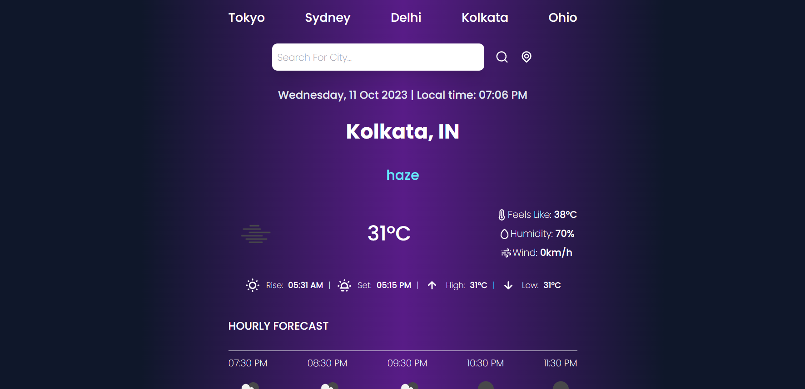
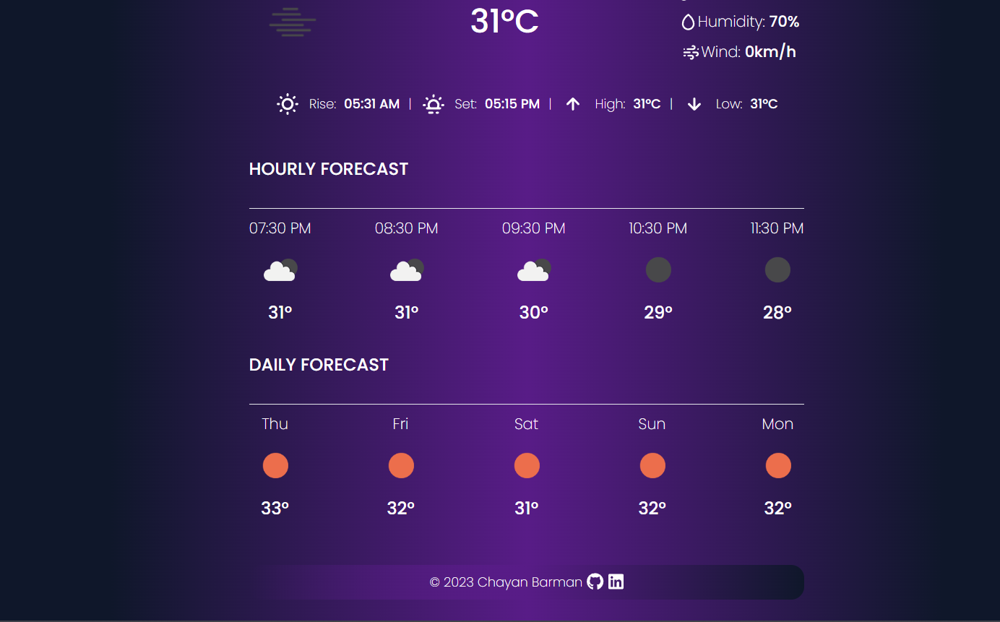

This application is a weather forecasting tool developed with React, styled with Tailwind CSS, and integrated with the OpenWeather API. Users can search for weather and forecasts by entering the name of their preferred city. Additionally, they have the option to access real-time weather data for their location using geolocation.
